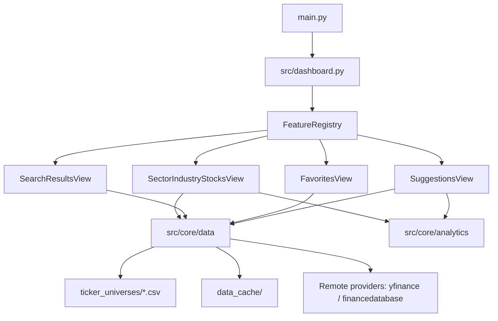

# Sector Rotation App Design

## Purpose

The app helps users analyze market rotation through a feature-driven Streamlit UI:

- Drill down from universe to sector/industry/stock
- Search across universes
- Manage favorites
- Generate trend/volume-based suggestions

## Design goals

- Keep the dashboard shell thin and feature-agnostic
- Encapsulate feature behavior behind a shared contract
- Isolate data access and analytics from UI concerns
- Keep testability high by validating behavior at module boundaries

## High-level architecture

## Runtime flow

1. `main.py` starts Streamlit and calls `src/dashboard.main()`.
2. `src/dashboard.py` renders top navigation and identifies active feature route.
3. `FeatureRegistry` resolves a `FeatureView` implementation.
4. The feature contributes:
   - Navigation controls (`render_nav_controls`)
   - Scope-aware refresh tickers (`get_refresh_tickers`)
   - Render arguments (`get_render_kwargs`)
5. Dashboard invokes `FeatureRegistry.render_route(route, **kwargs)`.

## Feature plugin model

The plugin contract lives in `src/core/ui/interface.py`.

- `FeatureView.get_route_name()` defines stable route identity
- `FeatureView.render(...)` renders the feature page
- Optional hooks allow feature-specific nav/refresh wiring without hardcoding in the dashboard

Registry responsibilities in `src/features/__init__.py`:

- Lazy registration of built-in feature classes
- Single-instance lifecycle per feature
- Uniform route rendering

## Data and analytics layering

- `src/core/data/` handles universe loading, search, cache, favorites, and data retrieval.
- `src/core/analytics/` handles derived computations used by feature views.
- Feature modules coordinate user intent; they should not duplicate low-level data fetch logic.

## State model

Streamlit `st.session_state` stores navigation and context state, including:

- Active feature/view
- Selected universe/sector/industry/stock
- Search query
- Feature-specific temporary values (for example import settings)

State conventions:

- Feature views own keys they introduce.
- Dashboard owns cross-feature routing keys.
- Feature transitions should clean stale keys when context changes.

## Caching and refresh behavior

- Data retrieval and computed results are cached in core modules and feature renderers.
- Top-nav refresh delegates cache invalidation scope to the active feature via hooks.
- Suggestions feature additionally clears memoized suggestion outputs on manual refresh.
- Tickers that repeatedly return empty data are tracked as temporarily unavailable in `data_cache/unavailable_tickers.json` and skipped until cooldown expires.

## Testing strategy

Test layout mirrors architecture:

- `tests/test_feature_routing.py` validates dashboard-to-feature delegation contracts
- `tests/features/` validates feature behavior
- `tests/core/` validates data/analytics/ui core modules
- `tests/modules/` validates shared renderer/chart/constants modules

When changing routing or feature hooks, update routing tests first to align with ownership boundaries.

## Extension guidelines

### New feature

1. Add `src/features/<feature>/` package.
2. Implement `FeatureView` methods.
3. Register in `FeatureRegistry._ensure_initialized()`.
4. Add route entry in dashboard mapping.
5. Add tests under `tests/features/` and routing tests.

### New universe or market

1. Add CSV to `ticker_universes/`.
2. Update market mappings in `src/constants.py`.
3. Validate sector proxy resolution and UI drill-down behavior.
4. Add or update tests for universe-specific behavior.

## Non-goals

- The dashboard shell should not contain feature-specific business logic.
- Feature modules should not bypass core data/analytics layers for duplicate implementations.